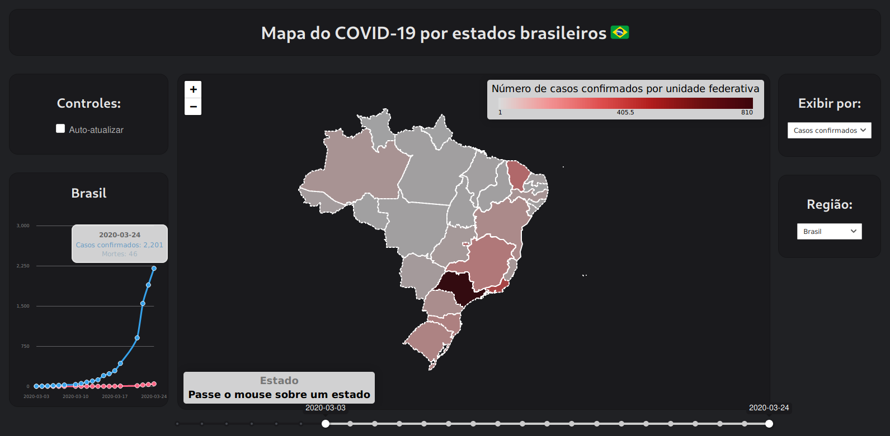

<h1 align="center">COVID-19 Brazil Map</h1>

  <strong>Mapa interativo de casos do (COVID-19) em cada estado do Brasil</strong>

   
    
   

## Motivação 🤔

Pover uma vizualização prática utilizando dados atualmente disponíveis sobre o coronavírus no Brasil.

## Datasets 💽

- [covid19-brazil-api](https://github.com/devarthurribeiro/covid19-brazil-api)

## License 📝

This project is licensed under the [GPL v3 License](https://opensource.org/licenses/GPL-3.0) - see the [LICENSE](LICENSE) file for details.

## Autor

<table>
  <tr>
    <td align="center"><a href="https://github.com/felipemarinho97"> <b>Felipe Marinho</b></a> </td>
  <tr>
</table>
